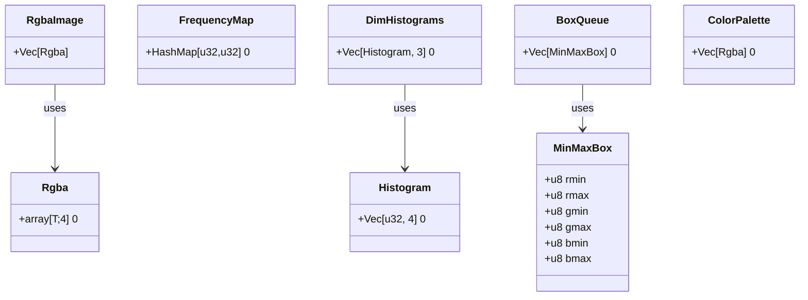
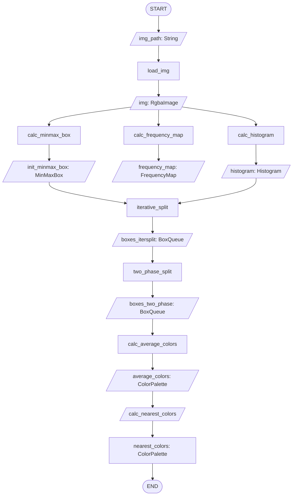

# [WIP] Color Thief with Rust

**This project is a work in progress.**

A Rust rewrite of `color-thief-py`. Color Thief generates a color palette based on a provided image. This repository is a Rust port of Shipeng Feng's [color-thief-py](https://github.com/fengsp/color-thief-py)

### References

Feng, S. (2017, February 9). *color-thief-py*. Github. [https://github.com/fengsp/color-thief-py](https://github.com/fengsp/color-thief-py)

Dhakar, L. (2024, October 5). *quantize*. Github. [https://github.com/lokesh/quantize](https://github.com/lokesh/quantize)

## Library Structure

### Data Models

- `calc_minmax_freq_histo` will also bin the pixels based through pixel shifting.
- Between `load_img` and `calc_minmax_freq_histo`, algorithm should check for pixel validity.
- `histogram` may need `inverse_histogram` and `volume_count_histogram` counterparts
- Need more details for `calc_nearest_colors`, `calc_average_colors`, `twophase_split`, and `iterative_split`
- `sort_boxes` should sort the BoxQueues before usage
- `split_box` should be implemented inside `iterative_split` and `twophase_split`

### Process Flowchart

