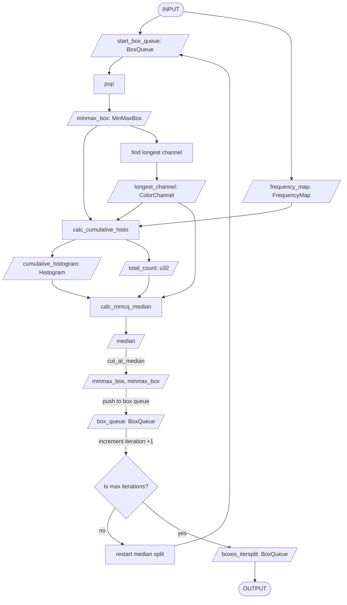

**Modified Median Cut Quantization (MMCQ) Algorithm Explanation**

1. **Create a 3D Color Space** - Each dimension represents one color channel (red, green, blue), i.e. represent colors as a 3D coordinate system.
2. **Color Histogram** - Bin the bits by the first 5 significant bits, then count the number of pixels in each binned color. In other words, reduce the number of colors by collecting them using their binary place numbers.
3. **Initial ColorSpace** - Encompasses all colors in histogram.
4. **Iterative Splitting** - Select largest box by count, find longest dimension, find median along dimension, split box at the median
5. **Two-phase Splitting** - Split by pixel `count` until 75% target colors, then split based on `count * volume`.
6. **Map Colors** - based on the average color per box
7. **Find nearest color** - Colors not in palette can try to find the nearest.

## Notes

- ~~Will separate `MinMaxBox` from `MMCQ`. `MMCQ` holds functions and methods that transform the data model `MinMaxBox`.~~ Created the MinMaxBox separately from MMCQ as a data model
- ~~Considering a better data model for pixels. It would be best to pass and calculate pixels as a set or vector instead of repeating operations thrice at different parts of the algorithm.~~ May now attempt to use the tuple style of Image Library.
- ~~In `color-thief-py`, `VBox.count()` can be optimized I by looping through the dictionary instead of the entire color space.~~ Looping through a hashmap is *slower* than looping through a vector or array.
- ~~Current architecture can be improved. Exploring algorithms that can encapsulate the creation of the `ColorSpace` / `VBox` structs. Suspect that the `histo`-generating function and the `ColorSpace` algorithm should be used in a single function. Perhaps `color_calc` can be composed of functions declared somewhere else. Especially important since a frequency calculator seems like a valuable algorithm to have for future projects.~~ Will indeed be restructuring the code to separate have a single `calc_minmax_freq_histo` to encapsulate calculating for both `Histogram`, `FrequencyMap`, and `MinMaxBox`
- Create a png without data for testing, there may be a weird case where the while loop may go on until max iteration. In `color-thief-py` line 241, it seems to do nothing when the vbox count is 0 then increments `n_iter` and continues the while loop until max iteration. I think think the program should cite this as a failure mode.
- The Priority Queue appears to sort each time the data changes but I wonder if the sorting is useful for the MMCQ algorithm. For most of it, it seems to only use the maximum value. May be better to only get max value then later run the full sort algorithm when getting the color palette.
- In contrast to the Priority Queue, it seems that getting the median will indeed need a sorting of some kind.
- ~~Replace `ColorSpace` with a `RGBBox` with only the minimums and maximums. A separate `FrequencyMap`  and `Histogram`~~ Added a `MinMaxBox` that only has minimums and maximums.
- To improve Do not Repeat Yourself (DRY), try using the match case to re-assign color values to `main_dim`, `side_dim1`, `side_dim2` then continue with the algorithm. This should stop repeating the algorithm since only the variables truly change. For `min` and `max` do the same with `main_dim_max` and `side_dim_max`.
- Does Color Thief need the frequency map? I think it may only need the histogram
- Use these variable and function names: `Rgba`, `hashed_color`


### (Possible) Upstream improvements
- According to Mozilla web docs using `~~` in Javascript is outdated practice [mdn web docs](https://developer.mozilla.org/en-US/docs/Web/JavaScript/Reference/Operators/Bitwise_NOT), better to use `Math.trunc()`. Thus, this [line](https://github.com/lokesh/quantize/blob/master/src/quantize.js#L488) from color thief could be improved.
- I suspect that this [line](https://github.com/fengsp/color-thief-py/blob/master/colorthief.py#L199) may have an issue in cases where the median was found at the max value of the color range and will need to walk backwards *but* finds that the value immediately below it is `0` or `None`. In that case, it might make a right side that is empty.

## Possible tests

```py
# Use this as basis for a Rust test
histo = {26380: 11, 1057: 1, 0: 1, 25166: 10, 20041: 206, 22122: 2813, 21958: 28, 10530: 48, 14693: 24, 32767:1}
vbox = colorthief.VBox(0,31,0,31,0,31, histo)
assert vbox.count == 3143
```

## Draft flow charts
**Iterative Split**

